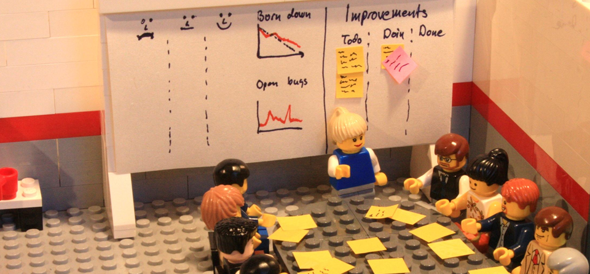
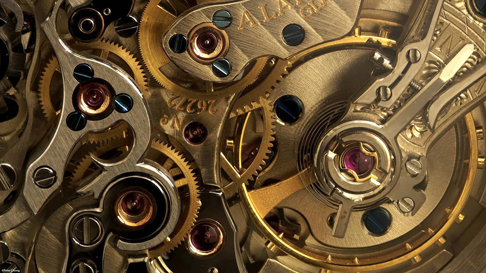
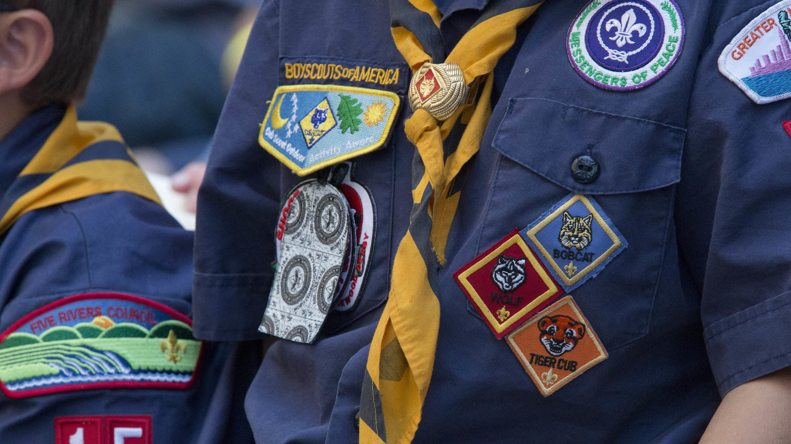
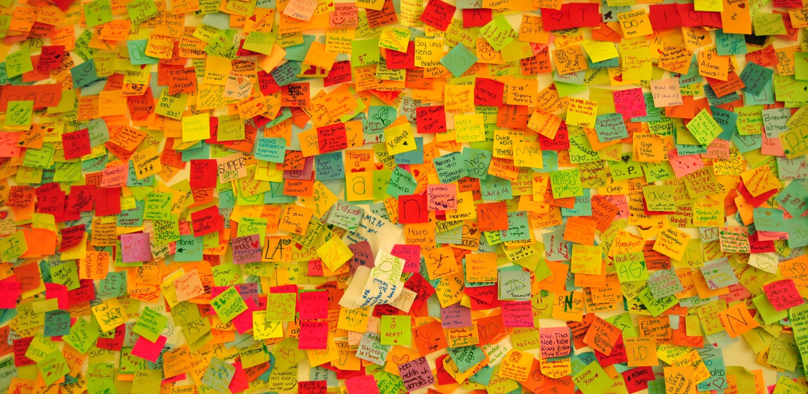

Retrospectives (retros) are the most important part of any agile team's process. Without them how could we possibly be agile? We'd never know how we could improve. As such, they should be at the center of our universe. If a team can make their retros a success then the team will be a success.

After running retros for a few years the aspects I've found to making retros successful are:

## Regular

Make sure your retros are happening and that they **always** happen, ideally at least every two weeks. It can seem easy to skip it and deprioritise it but at the very worst it should be rescheduled. Regular retros help the team; avoid making the same mistakes, share any burdens they have, share any knowledge they've gained. In general they help us grow so every chance we get to be more efficient and a better team we should take.

## Come prepared

Ensure that your team are prepared by sending out an email with what they should be thinking about in advance. Have them bring post it notes with all their thoughts written on so that the retro flows smoothly. A physical representation is always better and helps you visually see problem points and celebrate successes.

## Different

Change your theme up every time. People are programmed to find patterns in things and as a result we find it easy to get in a routine. The problem with this is when we get in a routine we always cover the same areas. By having different themes every time you create a different context for your team's brains to examine what's happened and find new ways to improve.

## Fun

Creating a setting that your team want to be involved will result in higher engagement and better quality outcomes. It also allows the team to relax and break up high intensity or stressful work which should allow them to be more productive in the long run and help towards avoiding burnout. Choosing a more active or involved retro theme, starting with a game or simply bringing snacks can be an easy way to inject some fun into a retro.

## Non judgemental

For a retro to be successful the team has to be completely honest with each other and the only true way to do this is to listen without judgement. This should include self-judgement as by laying blame on yourself or self-deprecation the implication is that the rest of the team should feel the same. Always remember the **Prime Directive**:

> Regardless of what we discover, we understand and truly believe that everyone did the best job they could, given what they knew at the time, their skills and abilities, the resources available, and the situation at hand.
>
> <cite>Norm Kerth</cite>

## Actions

The most important outcome of a retro is change, we want to be constantly improving and to make retros valuable the team needs to see change for the better. Make sure an action is taken, get a volunteer to be responsible that it happens and put it in a highly visible place (e.g. a whiteboard) so that nobody forgets. Perhaps even keep your actions when they're done so you can see all the awesome things the team has done.
