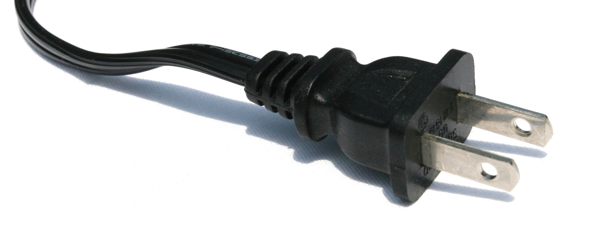

## TL;DR

Grouping NPM dependencies can give you the following advantages

* **Slimmer apps** - save you precious bytes from dependencies that aren't even needed and could even potentially add security holes
* **Easier to manage dependencies** - having a tidy `package.json` explains where you're using dependencies and if they can or should be changed or removed
* **Easier troubleshooting** - creating a cleaner `node_modules` folder in production for easier troubleshooting

## Understanding the types

Knowing the differences between types of dependency that NPM allows you to have enables you to manage your build and dev experiences optimally.

### dependencies


This is the most commonly used group but is named the least clearly as this is too broad. Essentially this actually means "production dependencies" i.e. things that your application or node module will require to run in the wild. Examples of these could be utility libraries e.g. `ramda` and `rxjs` or web servers `koa`, `express`.

Things get a bit more tricky when we talk about web applications as often dependencies are bundled together for performance reasons. In this scenario you don't also want a copy in your `node_modules` folder taking up space. For these sorts of dependencies we should be using **bundled dependencies** (more info coming up).

#### How do I know I have one?

**node module:** when the dependency is being used in the wild

**application:** when the dependency is running on the server side

#### How do I install one?

```cli
> npm install <DEPENDENCY_NAME> --save
```

### dev dependencies


Dev dependencies should be constrained to tools that are only used for the development process. They should not be used at all when running the app but could include tools that are used to build the app or node module e.g. `webpack`.

Types of dev dependencies include (but are not limited to);

* testing tools
* compilers
* linters
* bundlers

#### How do I know I have one?

**node module:** when the dependency is only being used during development

**application:** when the dependency is only being used during development

#### How do I install one?

```cli
> npm install <DEPENDENCY_NAME> --save-dev
```

### peer dependencies



In some cases your a package may never be used directly by the code you are writing but you intend for it to be used in conjunction with another (usually this would be as a plugin). Use peer dependencies to let people installing your package know they should also install the core package too and what versions your plugin is compatible with. This can be quite a niche use case but a good one to be aware of.

#### How do I know I have one?

**node module:** when the dependency is designed to be used with another package but doesn't necessarily use it directly (e.g. it's a plugin)

**application:** no clear use case

#### How do I install one?

```cli
> npm install <DEPENDENCY_NAME> --save-peer
```

### bundled dependencies


Often as part of a build process certain 3rd party pieces of code may be added to the final production piece of code. If you're doing this with any of your dependencies, you've got a bundled dependency. The most common use case for this is libraries to be used in the front end e.g. `react` or `rxjs` that we want to bundle into one core package to be downloaded all at once.

#### How do I know I have one?

**node module:** when the dependency is bundled for single install e.g. using `npm pack`

**application:** when the dependency is bundled for client side delivery e.g. by webpack

#### How do I install one?

```cli
> npm install <DEPENDENCY_NAME> --save-bundle
```

### optional dependencies


Rare but basically your package or app doesn't need it but there shold be some benefit if it's available. Potentially could be a link that isn't always available so you've created a failsafe that if npm install fails due to this not being available the package or app will gracefully degrade.

#### How do I know I have one?

**node module:** when the dependency is not necessary or can be one of a selection of dependencies

**application:** when the dependency is not necessary or can be one of a selection of dependencies

#### How do I install one?

```cli
> npm install <DEPENDENCY_NAME> --save-optional
```

### A note about typing files

Typing dependencies for `typescript` are a special case, for the most part they will be dev dependencies with the exception of when you are creating a node module that exposes a type within that typing file. For example, if you are creating a `react` component library you will probably be exposing a couple of types from `@types/react` so this would then become a dependency rather than a dev dependency.

### You have the power!

Congratulations, you now have the power to harness your `package.json` to make your application even better. In practice all you need to keep in mind is when building your application first run `npm install` then once your done bundling and everything else you have to do clear down your `node_modules` folder and run `npm install --production` to make sure you only have what you need. An example of this can be seen in my [docker tutorial](/blog/getting-started-with-docker).
