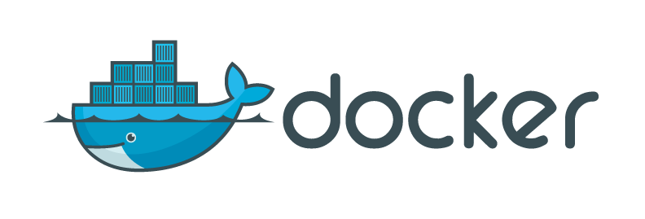

For the uninitiated, Docker allows you to create containers that are composed of an operating system, some libraries and your application all in one neat package. But *why* should you use it and what benefits will it bring you?

## Predicatable

The phrase *"works on my machine"* is the call of the frustrated and confused developer. You've spent so long working on that great new feature and as soon as it get's tested BAM! it doesn't work despite your careful testing. Docker gives you the ability to standardise your environment entirely so when you run your application it will run under the same conditions as the server and eliminates those nasty unexpected integration issues.

## Portable

Once you have a Docker image you can run that as a container on any platform that supports Docker. If you want to move cloud providers due to a cost benefit or extra functionality that's no problem because you've defined your environment you should be able to run your app anywhere!

It also gives you the option of ultimate disaster recovery, when your cloud provider fails your clients can rest assured you can spin the app up on another provider.

What if the client wants to run the app internally, gone are the days of having to support their custom setups just have them install Docker and they can run the app exactly as you would on your local machine or as a cloud app.

## Small

Again because you are in control of the environment you can pick and choose between what operating system you use and what libraries are installed on it. This ensures that when you want to send the app anywhere it minimises the time it takes.

More importantly it means the maximum amount of resources can be used by your app and not by some obscure part of the operating system or a library you don't even use.

As a nice side effect, by eliminating this excess you close some potential security holes which makes everyone take a big sigh.

## Emulation

It's not just your app that has been Dockerized so have countless others. Which means you can use them too simply by running them as a Docker container. Also, a lot of cloud infrastructure is available as emulators in containers so you can test your app locally without having to connect to real queue providers or storage accounts.

You can even create files that list out all the containers you need to emulate the environment so local developers can have a simple way of setting up their environments.

What's more databases can be and are Dockerized allowing you to set up different states for different versions of your app so you can switch between them avoiding migraiton issues. Also by Dockerizing a database state you can run end to end tests with consistent results!

## What are you waiting for?

Now that your utterly convinced give it a go with [this tutorial](/blog/getting-started-with-docker)
